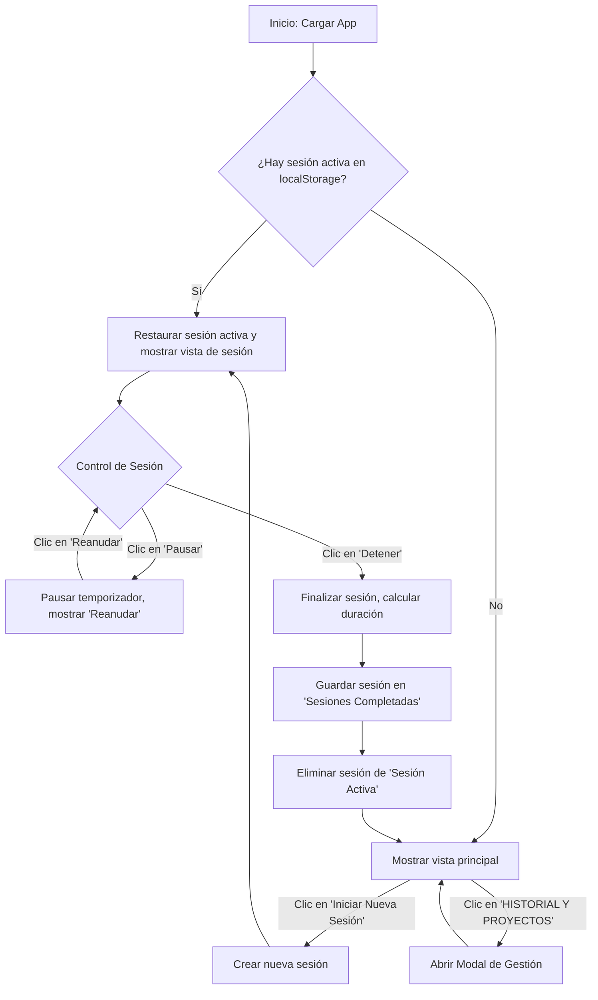
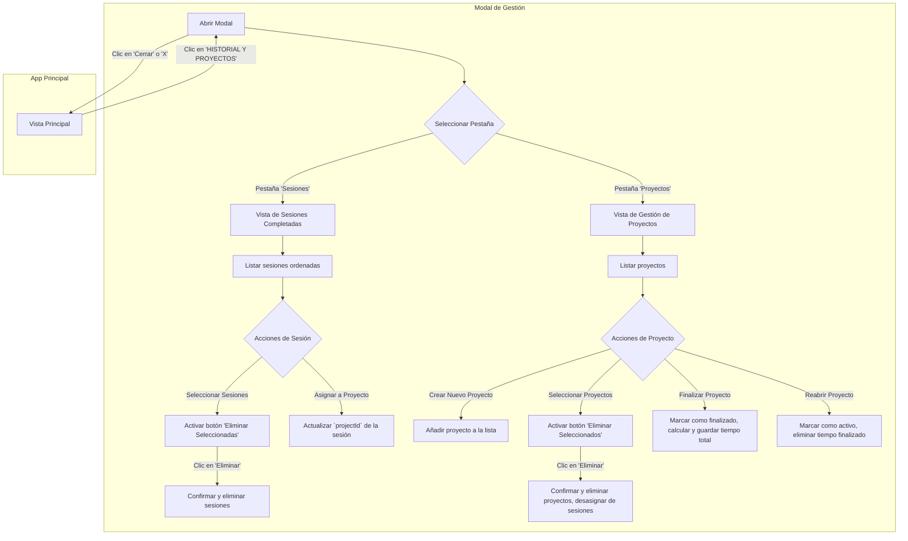

# Diagrama de Flujo de la Aplicación

Este documento utiliza la sintaxis de Mermaid para ilustrar los flujos de usuario principales de la aplicación "Registro de Sesiones y Proyectos".

## Flujo Principal y de Sesión Activa

Este diagrama muestra el ciclo de vida desde que se carga la aplicación hasta que se inicia, pausa, reanuda y detiene una sesión.

## Flujo de Gestión en el Modal

Este diagrama detalla las acciones posibles dentro del modal de "Historial y Gestión de Proyectos".

